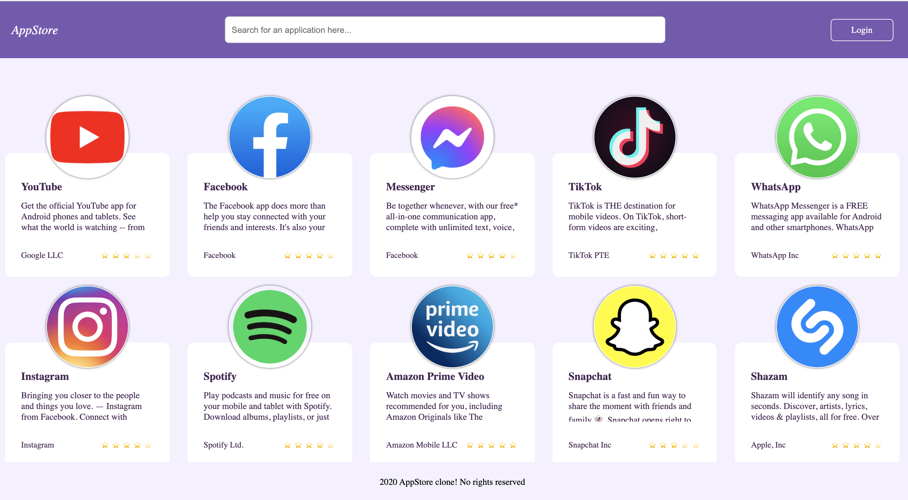
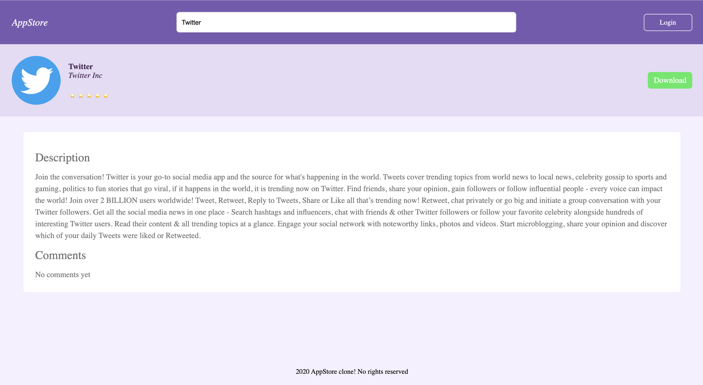
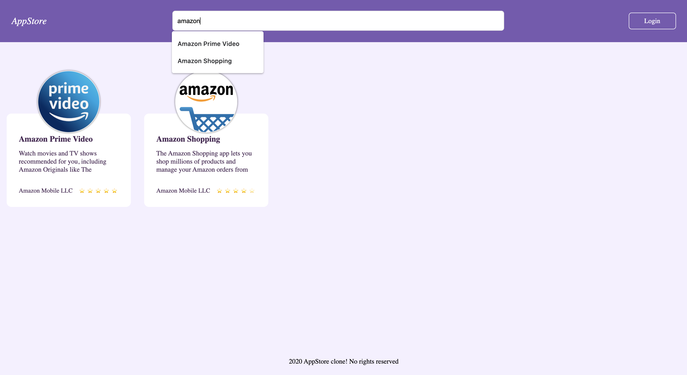
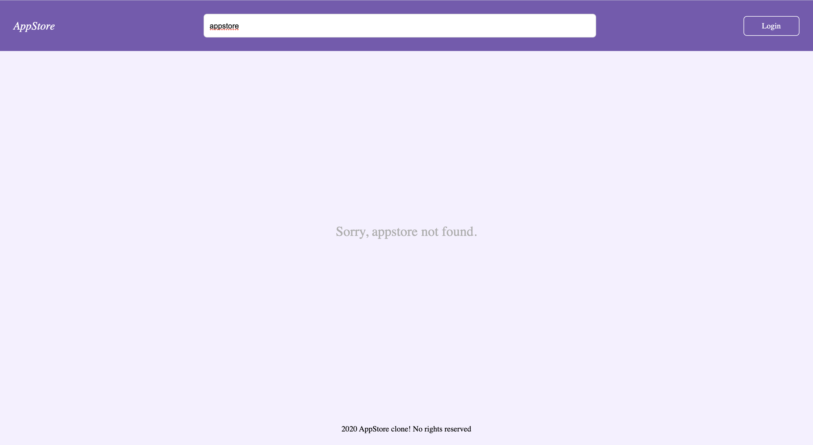

# Live Demo

 https://appstore-frontend.herokuapp.com/

# AppStore

This is a MERN stack demo application.

You can signin/signup with Firebase Authentication.

Frontend project is build with React Hooks & Context API is used for state management.

Backend project is build with Node.js and Express is used as a web application framework. Also MongoDB is used as database to persist the data.

# Deployment

Both backend and frontend projects were deployed on heroku.

# Screenshots

